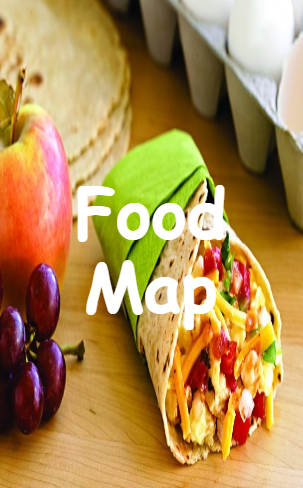
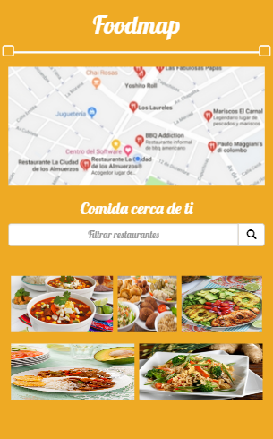
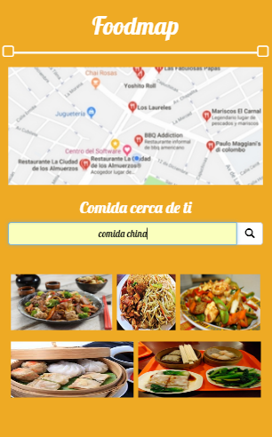
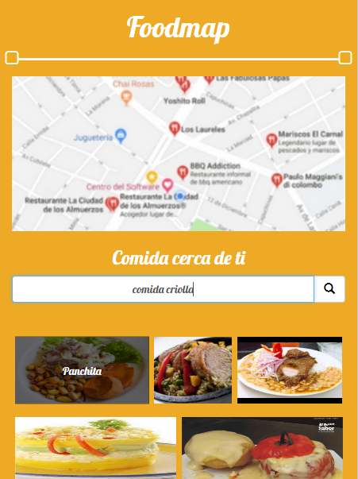
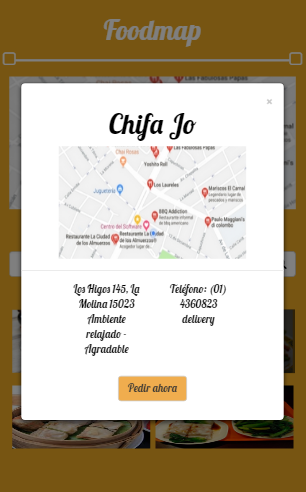

# Food Map

- Esta página le ayudará a buscar los mejores restaurantes cerca de usted, bajo estos cinco tipos de comida (comida china, comida sana, comida criolla, comida rapida, comida mexicana). Pronto implementaremos más, gracias por su visita esperamos la disfrute.

## Objetivo del reto

- El objetivo de esta pagina es filtar a través de un input los restaurantes que se encuentran cerca de usted, esto lo haremos escribiendo uno de los cinco tipos explicado arriba.

## Flujo de la aplicación

- Vista splash con duración de 2 a 5 segundos que redirecciona a la vista principal. 
- En la vista principal se muestran todos los restaurantes "cerca de ti" junto con el input para filtrar.
- Evento mouseover a las imágenes.
- Al seleccionar alguno de los restaurantes, se mostrará la información de este a través de un modal.
- Una vez cerrado el modal vuelve a la vista principal.

## Flujo de trabajo

- Primero creamos la estructura HTML, en forma anidada.
- Comentar el código.
- Enlazamos el archivo externo del CSS, esto para un mayor orden y hacer uso de las buenas practicas.
- Enlazamos los archivos descargados, para hacer uso de las herramientas de Bootstrap.
- Enlazamos los archivos descargados, para hacer uso de los selectores de Jquery.
- Luego continuamos trabajando en CSS.
- Comentar el código.
- Subimos avances a github.
- Terminar de dar estilo con CSS.
- Empezamos a trabajar en JS utilizando Jquery, para dar interacción a la página.
- Comentar el código.
- Subimos avances a github.
- Cumplimos con el objetivo.
- Digitar el archivo README.md
- Subir el producto final a github.
- Crear la rama "gh-pages".

## Herramientas Utilizadas

- Html, para la estructura del contenido.
- Css, para darle estilo al contenido.
- Bootstrap
- Jquery

## Fuente consultada

- [Laboratoria LMS] : https://lms.laboratoria.la/cohorts/lim-2017-09-bc-core-pm/courses/social-network/02-jquery/01-jQuery

- [Bootstrap] : https://getbootstrap.com/docs/3.3/css/#forms

- [W3School] : https://www.w3schools.com/bootstrap/bootstrap_forms.asp

- [Jquery]: https://oscarotero.com/jquery/

## Imagen 

- Vista Splash

- Vista Restaurant

 

- Filtro para restaurants 

 

- Mouseover a la imagen

- Modal con la información del restaurante

